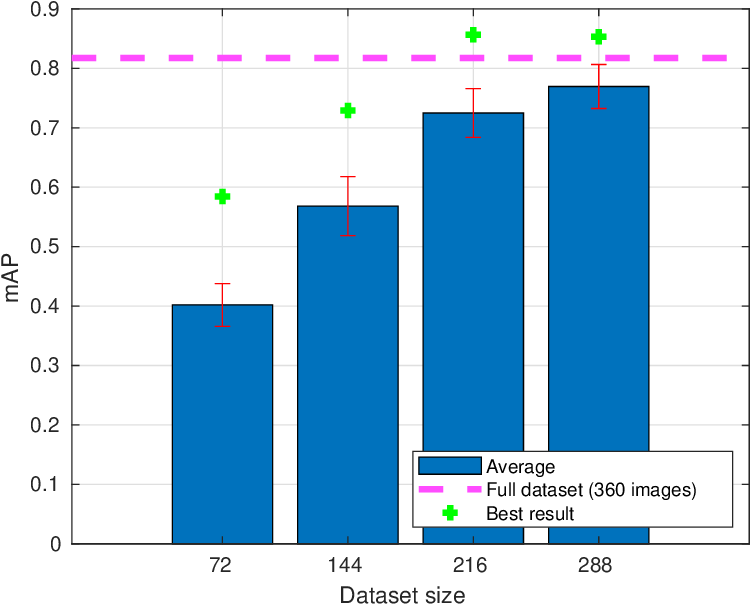

# Automating Sports Broadcasting using Ultra-High Definition Cameras, Neural Networks, and Classical Denoising

## Sophia Rosney, Ciaran Donegan, Meegan Gower, Wissam Jassim, Hugh Denman, Donal Scannell, and Anil Kokaram

### Sigmedia Group, Electronic and Electrical Engineering Dept., Trinity College Dublin, Ireland

SPIE Optics & Photonics 2022 Conference - project page

<video src='media/red_box_demo.mp4' width="100%"/>

### Studying the effects of training dataset on model performance
